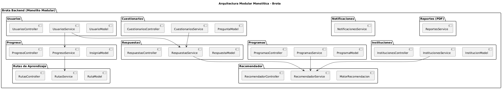

# 🏗️ Arquitectura Actual - Sistema Brota

## Visión General

Brota utiliza una arquitectura de tres capas que separa la presentación, lógica de negocio y persistencia de datos.

## Diagrama de Arquitectura



## Componentes Principales

### Frontend

- Interfaz de usuario para estudiantes
- Cuestionario vocacional interactivo
- Visualización de recomendaciones
- Panel administrativo básico

**Tecnologías**: (Por definir en documentación técnica de frontend)

### Backend

- API RESTful para comunicación con frontend
- Lógica de negocio del algoritmo de recomendación
- Gestión de autenticación y autorización
- Procesamiento de cuestionarios
- Gestión de convocatorias y fechas

**Tecnologías**: (Por definir en documentación técnica de backend)

### Base de Datos

- Almacenamiento de instituciones y programas curados
- Perfiles de usuario y resultados de cuestionarios
- Convocatorias con control temporal
- Recomendaciones generadas

**Tecnologías**: (Por definir en documentación técnica de backend)

## Modelo Entidad-Relación

.png>)

## Flujo de Datos Principal

1. **Estudiante completa cuestionario** → Frontend captura respuestas
2. **Frontend envía datos** → Backend API recibe información
3. **Backend procesa** → Algoritmo genera perfil vocacional
4. **Backend consulta** → Base de datos busca programas compatibles
5. **Backend filtra** → Elimina convocatorias vencidas
6. **Backend genera** → Crea recomendaciones personalizadas
7. **Backend responde** → Envía recomendaciones al frontend
8. **Frontend muestra** → Presenta resultados al estudiante

## Separación Programa-Convocatoria

### Decisión Arquitectónica Clave

Se decidió separar `Programa` y `Convocatoria` en entidades distintas para:

#### Ventajas

- ✅ **Control temporal**: Fechas de apertura/cierre independientes
- ✅ **Ocultamiento automático**: Programas vencidos no aparecen en recomendaciones
- ✅ **Notificaciones internas**: Alertas al equipo sobre convocatorias próximas
- ✅ **Escalabilidad**: Un programa puede tener múltiples convocatorias
- ✅ **Historial**: Mantener registro de convocatorias pasadas

#### Relación

```
Programa (1) ----< (N) Convocatoria
```

Un programa puede tener múltiples convocatorias a lo largo del tiempo.

## Principios Arquitectónicos

### 1. Curación sobre Automatización

- No se utiliza scraping masivo
- Información verificada manualmente
- Control de calidad prioritario

### 2. Escalabilidad Progresiva

- Arquitectura preparada para crecer
- Módulos desacoplados
- Fácil adición de nuevas funcionalidades

### 3. Simplicidad del MVP

- Solo lo necesario para funcionar
- Sin sobre-ingeniería
- Iteración basada en feedback real

## Seguridad y Privacidad

- Datos de estudiantes protegidos
- Autenticación y autorización implementadas
- Cumplimiento con normativas de protección de datos

## Consideraciones de Despliegue

Ver [Guía de Deploy](guia_deploy.md) para detalles de infraestructura y despliegue.

---

[← Volver al inicio](00_START_HERE.md)
