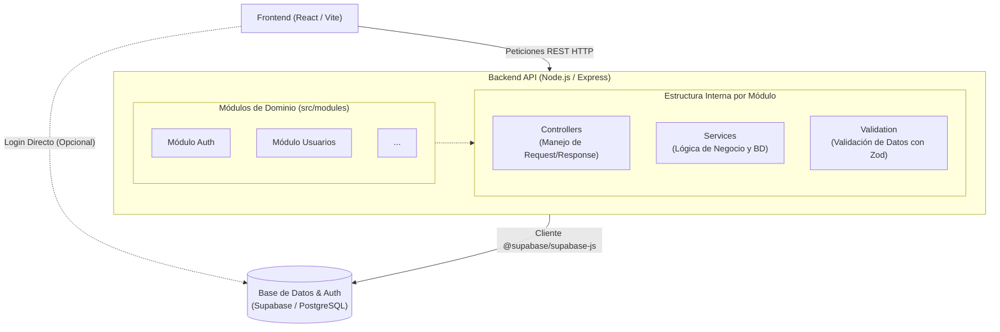

# 🏗️ Arquitectura Actual - MVP Brota

## Visión General

El MVP de Brota utiliza una arquitectura híbrida que combina **Node.js/Express** para el manejo centralizado de la API y **Supabase** como Backend-as-a-Service (BaaS) para la persistencia de datos (PostgreSQL) y la gestión de autenticación.

## Diagrama de Arquitectura

## Componentes Principales (MVP)

### Frontend
- Interfaz de usuario desarrollada en React.
- Comunicación con el Backend a través de peticiones HTTP REST.
- (Ver documentación del Frontend para más detalles).

### Backend
- Servidor central inicializado con **Node.js** y **Express**.
- Estructurado por dominios/módulos independientes (Ej: `auth`, `usuarios`).
- Cada módulo enfoca su responsabilidad implementando las capas de **Controllers**, **Services**, y **Validation**.
- **Se ha abstraído/eliminado la capa manual de Rutas** por módulo, simplificando la declaración de endpoints directamente en los archivos principales o inyectando los controladores dinámicamente, promoviendo un MVP más escalable y menos acoplado.

### Base de Datos y Servicios Core
- **Supabase** provee la infraestructura esencial de Backend:
  - Base de Datos relacional escalable (PostgreSQL).
  - Autenticación segura lista para usar.
  - Almacenamiento seguro en la nube.

## Modelo Entidad-Relación

Ver el modelo de datos actualizado en [diagrama_mer.md](../Data_Base/diagrama_mer.md).

## Flujo de Datos Principal (MVP)

Debido a que el desarrollo se encuentra en etapa MVP, el flujo de datos se simplifica a operaciones directas con el usuario:

1. **Usuario interactúa** → El Frontend captura la acción de interacción (ej. registrarse, actualizar perfil).
2. **Frontend envía datos** → Se despacha una petición REST hacia la API del Backend.
3. **Backend valida** → La capa de `Validation` (ej. vía **Zod**) asegura que la forma de los datos sea la esperada.
4. **Backend procesa** → Los `Controllers` capturan la carga útil y delegan la ejecución hacia los `Services`.
5. **Integración con BD** → Los `Services` utilizan `@supabase/supabase-js` para interactuar con la instancia remota de PostgreSQL.
6. **Backend responde** → La información final procesada se empaqueta en JSON y retorna.
7. **Frontend muestra** → La aplicación renderiza los cambios reflejados tras la respuesta del servidor.

## Principios Arquitectónicos

### Simplicidad del MVP
- Funcionalidad mínima requerida para soportar el flujo del usuario.
- Iteración constante fundamentada en validación en vivo.
- Código fuertemente tipado en validaciones de entrada, priorizando la estructura modular interna.

### Escalabilidad Progresiva
- Arquitectura preparada para crecer de un monolito modular a servicios más robustos a futuro si es necesario.
- Módulos independientes y desacoplados bajo DDD (Domain-Driven Design).

## Consideraciones de Despliegue

Ver [Guía de Deploy](../guia_deploy.md) para detalles de infraestructura (Docker + Kubernetes).

---

[← Volver al inicio](../00_START_HERE.md)
