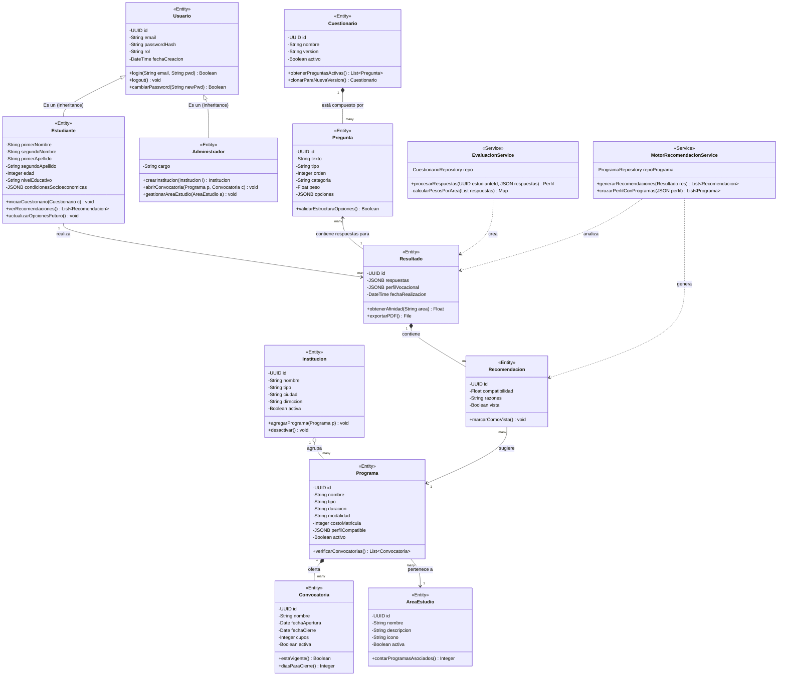

# Diagrama de Clases UML - Arquitectura en Capas (Sistema Brota)

A continuación se presenta el diagrama de clases modelando las entidades principales del dominio del **Sistema Brota**, así como las relaciones entre ellas según los principios de la Programación Orientada a Objetos (POO). También se incluye una abstracción de la capa de servicios (Lógica de Negocio) requerida para la arquitectura multicapa.

Este diagrama ha sido adaptado reflejando la estructura actual de los datos (como `AreaEstudio`, el rediseño de perfil de estudiante, e Instituciones).

## Explicación Rápida de las Relaciones

1. **Herencia (Triángulo blanco):** `Estudiante` y `Administrador` heredan las características base y el ID de `Usuario`. En Supabase esto se traduce a la tabla externa `auth.users` conectada a la tabla `perfiles_usuario`.
2. **Composición (Rombo negro):** Indica dependencia estricta. Si borras un `Cuestionario`, las `Pregunta`s que lo componen también desaparecen (Cascade Delete). Lo mismo ocurre entre `Programa` y `Convocatoria`, y `Resultado` con `Recomendacion`.
3. **Agregación (Rombo blanco):** Una `Institucion` agrupa varios `Programa`s, pero si se cierra el programa, la institución sigue existiendo.
4. **Asociación (Línea simple):** Refleja referencias lógicas más sueltas. Por ejemplo, una `Recomendacion` sugiere un `Programa`, un `Programa` pertenece a un `AreaEstudio`, y un `Resultado` almacena internamente las respuestas conectadas a múltiples `Pregunta`s.
5. **Dependencia (Línea punteada):** Utilizada en las capas de servicios para mostrar qué componentes necesitan a otros para funcionar. Por ejemplo, `MotorRecomendacionService` depende de analizar un `Resultado` para inferir compatibilidad y luego generar las instancias de `Recomendacion`.

**Visibilidad de Atributos UML (Símbolos):**
- `-` Privado (Accedidos vía métodos/encapsulamiento).
- `+` Público.
- `#` Protegido (Para clases hijas).
