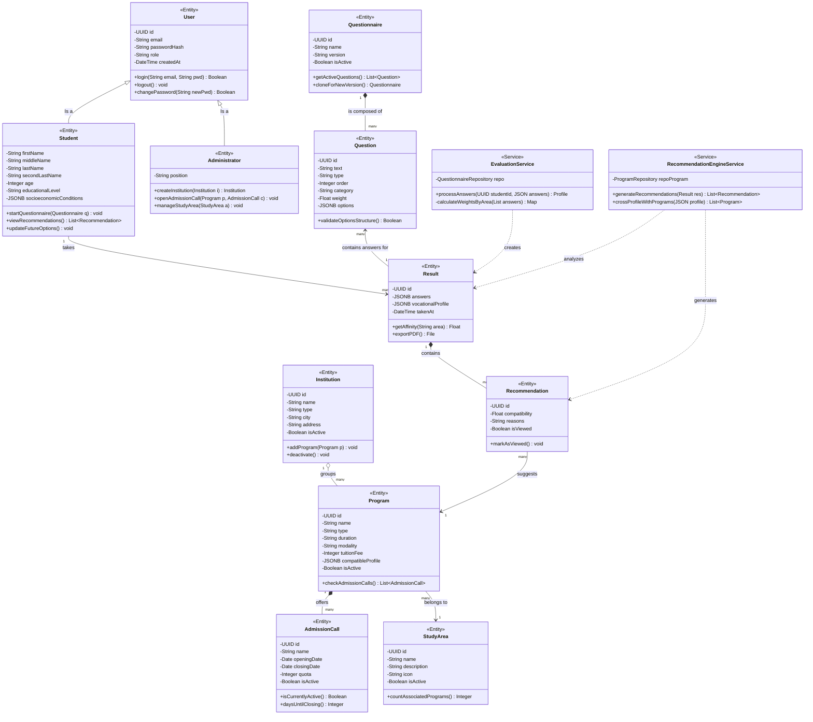

# UML Class Diagram - Layered Architecture (Brota System)

Below is the class diagram modeling the main domain entities of the **Brota System**, as well as the relationships between them according to Object-Oriented Programming (OOP) principles. It also includes an abstraction of the services layer (Business Logic) required for the multi-layered architecture.

This diagram has been adapted to reflect the current data structure (such as `StudyArea`, the student profile redesign, and Institutions).

## Quick Explanation of Relationships

1. **Inheritance (White triangle):** `Student` and `Administrator` inherit the base characteristics and ID from `User`. In Supabase, this translates to the external `auth.users` table connected to the `perfiles_usuario` (user profiles) table.
2. **Composition (Black diamond):** Indicates strict dependency. If you delete a `Questionnaire`, the `Question`s that compose it also disappear (Cascade Delete). The same occurs between `Program` and `AdmissionCall`, and `Result` with `Recommendation`.
3. **Aggregation (White diamond):** An `Institution` groups several `Program`s, but if the program is closed, the institution still exists.
4. **Association (Simple line):** Reflects looser logical references. For example, a `Recommendation` suggests a `Program`, a `Program` belongs to a `StudyArea`, and a `Result` internally stores the answers connected to multiple `Question`s.
5. **Dependency (Dotted line):** Used in the service layers to show which components need others to function. For example, `RecommendationEngineService` depends on analyzing a `Result` to infer compatibility and then generate the `Recommendation` instances.

**UML Attribute Visibility (Symbols):**
- `-` Private (Accessed via methods/encapsulation).
- `+` Public.
- `#` Protected (For child classes).
